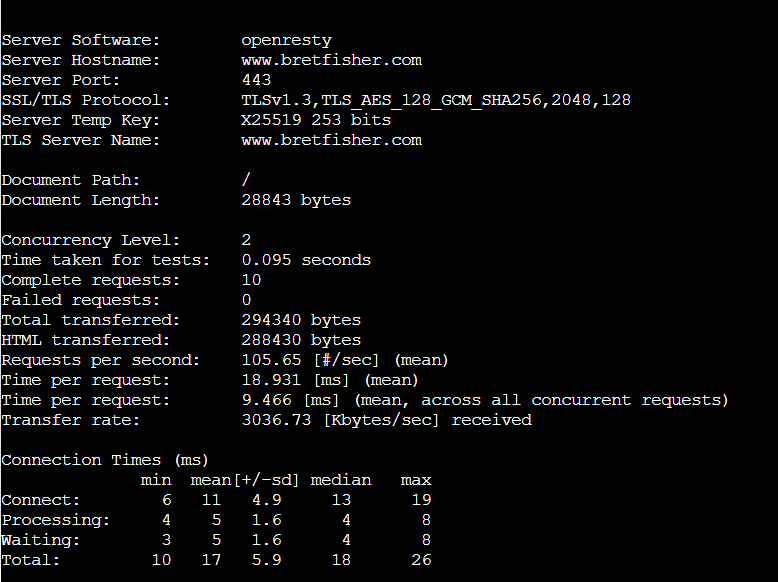

# Apachebench assignment

Building this image simply shows the benchmarks of the specified website in the CMD 

```
docker build -t ab .
docker run ab 
```

Running these outputs the following data

