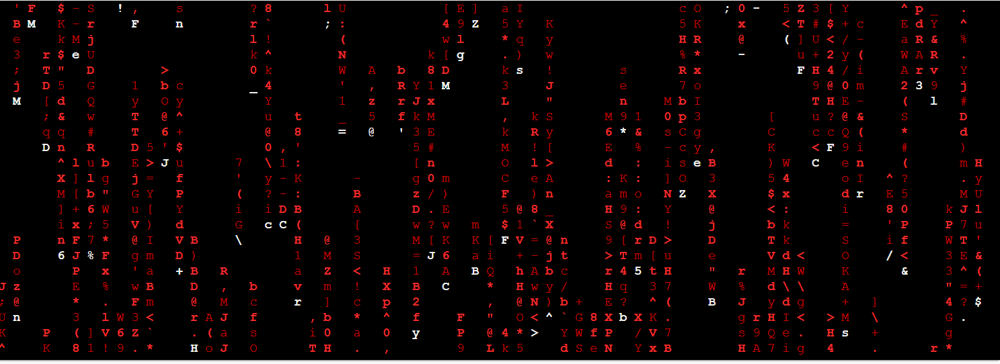

# cmatrix screen saver 

Before running the docker file, it first needs to be built before being able to access the shell

```
docker build -t cmatrix . 
docker run -it --entrypoint sh cmatrix
```

Otherwise we can also use **docker run -it cmatrix**. The result is a screensaver.



