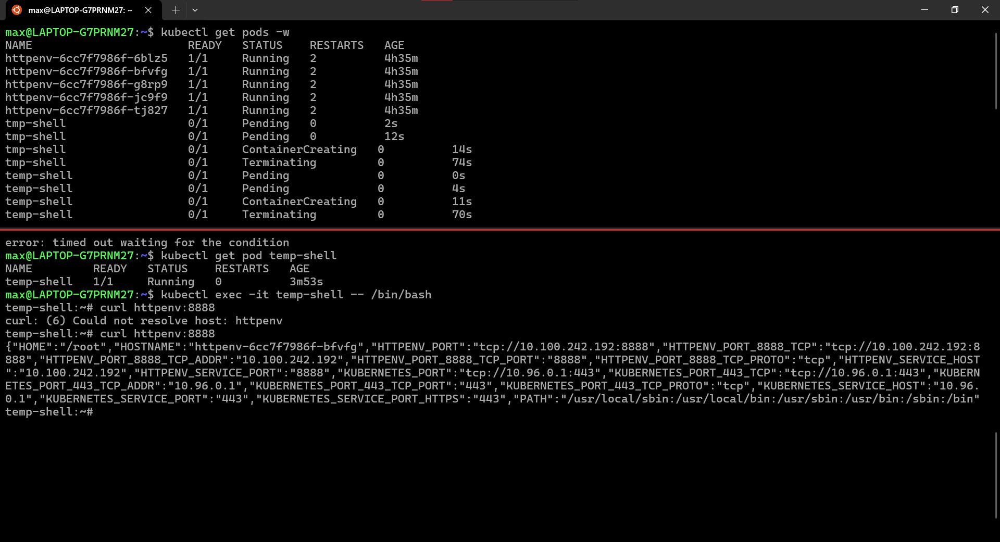
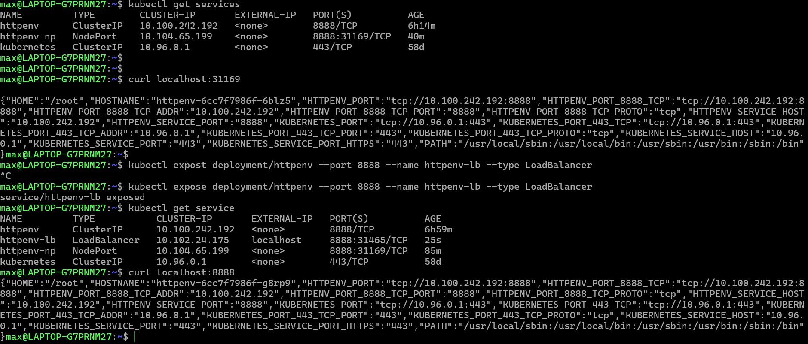

# Service Types 

A service is an **endpoint** that is consistent so the other things inside or outside the cluster can access it.
Creating pods in Kubernetes don't automatically get a DNS name for external connectivity, this is done by creating a service. 

- **kubectl expose** creates a service for existing pods 
- CoreDNS is our DNS server to resolve the names of services, picking IP, port and how it gets traffic.
<details>
<summary>Types:</summary> 
 - ClusterIP (default) 
 - NodePort      (when something outside the cluster needs to talk to the services, has a high port assigned)
 - LoadBalancer  (allows for incoming traffic from a provider)
 - ExternalName  (for migration)
 - also used for controlling the dns inside kubernetes, and changing the endpoint  
</details>

---

# Creating a ClusterIP Service 

For this example I will be watching from a split terminal as a service is made. Then curl the web server to view the environment variables. 

```
kubectl get pods -w 

kubectl create deployment httpenv --image=bretfisher/httpenv
kubectl scale deploy/httpenv --replicas=5
kubectl expose deploy/httpenv --port 8888
kubectl get service 
```
- We expose the deployment and tell it what port to listen on. This creates additional features not related to the pods.
 - It creates a cluster IP by default 
 - This is created in front of the deployment 

## cURL the ClusterIP Service 

The pod created will be called tmp-shell, and once it stops it must be removed. A bash shell into the pod is needed when running the custom image.

```
kubectl run tmp-shell --rm -it --image bretfisher/netshoot -- /bin/bash 

curl httpenv:8888
```
> The service name we created, becomes part of the DNS name. 



---

## Creating a NodePort and LoadBalancer Service 

NodePort is exposed externally and would be used in cases where you were in a data center and didn't have a load balancer to control with the **load balancer** service.
- In this case a NodePort would be done to get ports in the high range of our K8s cluster to talk to from the outside in.\
- Since it is a high port, usually an external load balancer or automated service is used in front which will manage it

```
kubectl expose deploy/httpenv --port 8888 --name httpenv-np --type NodePort 
kubectl get services
```
- We use --type to change it because the default type is ClusterIP 
- NodePort service also creates a ClusterIP service, this also shows it is additive. Meaning each one creates the services above it.

> It is also possible to curl the ClusterIP directly instead of opening a bash inside the pod
```
curl localhost:<high port number> 
```
---

Docker desktop comes with a built-in LoadBalancer unlike Amazon which uses ELBs and ALBs.

```
kubectl expose deployment/httpenv --port 8888 --name httpenv-lb --type LoadBalancer
kubectl get services 
curl localhost:8888
```
- The LoadBalancer service from docker will then publish on port 8888, which allows K8s to be on a specific port outside from the default set.



---

## Cleaning up 

```
kubectl delete service/httpenv service/httpenv-np 
kubectl delete service/httpenv-lb 
kubectl delete deployment/httpenv 
```
