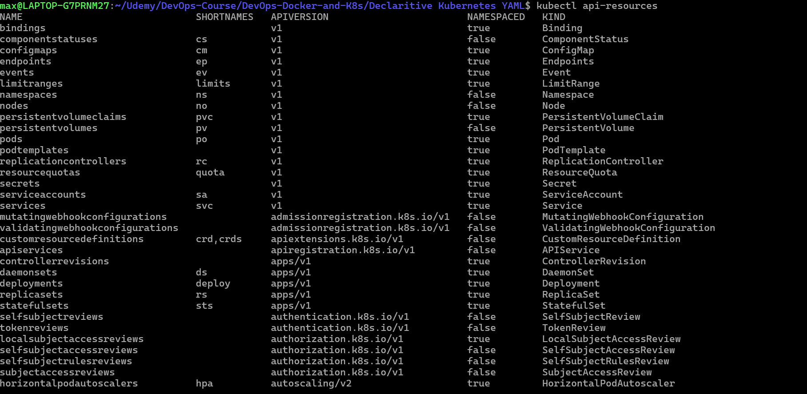
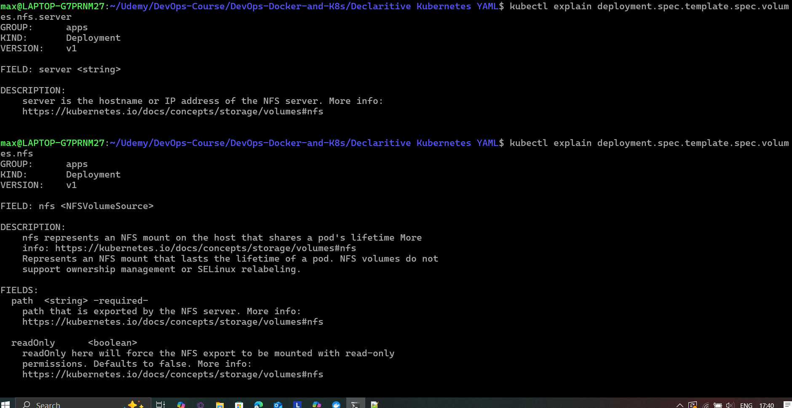

# Kubernetes Configuration YAML

The standard is to write the YAML which will then be converted to JSON. Files can also have many resources, also called a manifest.

- Manifests has requirements which describe the API object. 
- Manifests need four root key:values. These include **apiVersion, kind, metadata and spec**

Because Kubernetes is so complex, there is no base format for all the different resource types. The files can also be extended by adding more resources with CRDs

- The format is extensible depending on whats installed on the cluster 

---

# Building YAML files

- Kind: we can get a list of resources in our setup test clusters
- The list will grow as more resources is added to production
```
kubectl api-resources 
```



- With this we can see the different kinds of resources, kind deployments and pods etc.
- It serves as a starting point when creating the yaml file, it also shows the api group which is related to the version
- The api group specifies where in the api the resource can be accessed, some resources have multiple APIs 

```
kubectl api-versions
```

- We can get API versions the cluster supports 
- The **kind:** + **apiVersion:** determine what resource will be fetched and which API version will be able to use that resource
- Then the **metadata:** part will be created, which is the name of the resource that will be created 
- **spec:** is completely different based on each resource being created 

## Building YAML spec 

We can get keys for each resource type 

```
kubectl explain services --recursive
```

- this is a quick lookup of different timestamps at creation of yaml files 

```
kubectl explain services.spec 
```

- Acts as a more detailed breakdown to view the spec, it also gives a detailed description of the objects 

```
kubectl explain services.spec.type 
```

- This allows us to view a particular key inside the services that YAML tells us the type of LoadBalancer
- spec: we have a sub spec of other resources as well as way to view volumes etc. 

```
kubectl explain deployment.spec.template.spec.volumes.nfs.server 
```

 


